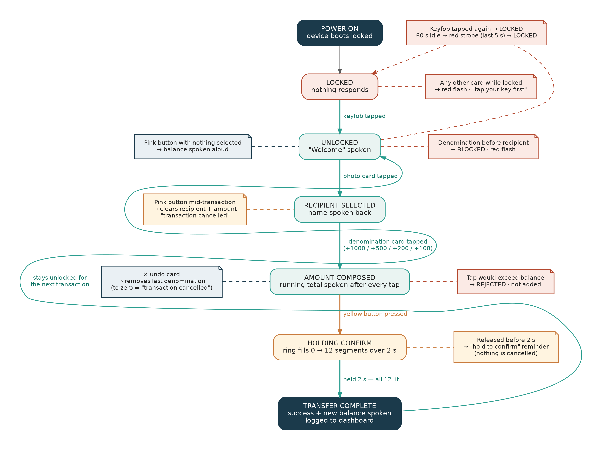
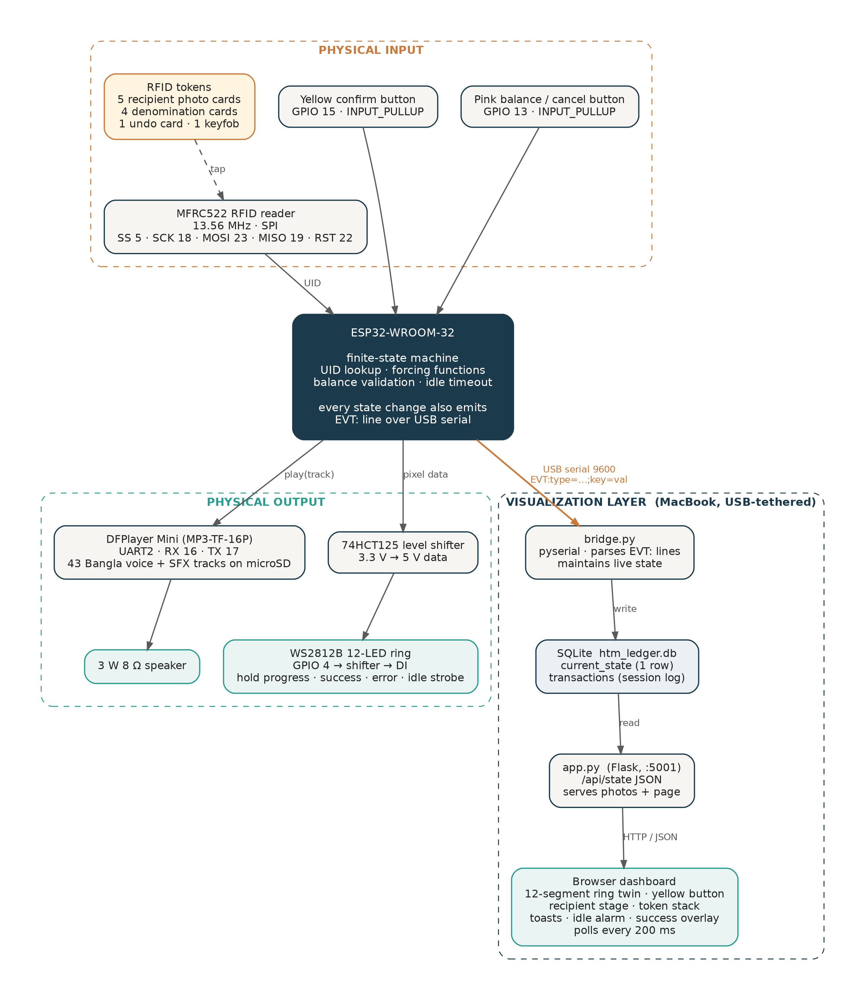

# HTM — Home Teller Machine

**A tangible banking interface for independent money transfer by elderly users with limited literacy.**

> A working hardware prototype that lets a person who cannot read or write send mobile money using only physical tokens, a key, a button, and spoken Bangla — with no screen, no keypad, and no PIN to share.



---

## Table of contents

- [Why this exists](#why-this-exists)
- [What it does](#what-it-does)
- [How a transfer works](#how-a-transfer-works)
- [System architecture](#system-architecture)
- [Hardware](#hardware)
- [Repository layout](#repository-layout)
- [Setup guide](#setup-guide)
- [Design rationale](#design-rationale)
- [Limitations and future work](#limitations-and-future-work)
- [Team and acknowledgement](#team-and-acknowledgement)

---

## Why this exists

Since January 2021, Bangladesh has required that government social-safety-net payments — including the **Old Age Allowance** and the **Widow and Destitute Women Allowance** — be paid through mobile financial services (MFS) rather than collected in person. As of the FY2026–27 revision this reaches over **6.2 million** elderly recipients.

That policy solved one problem and quietly created another. Banking apps and USSD menus (`*247#`) assume the user can read a prompt, remember a multi-step sequence, and correctly type an unverified recipient number. For a large share of the people this policy reaches, that assumption does not hold:

- Only around **39 % of Bangladeshis aged 65+ are literate** (World Bank) — roughly six in ten cannot read or write.
- Among elderly **women** the figure is closer to **30 %**.
- An estimated **5 million elderly Bangladeshis** are illiterate in absolute terms.

The documented workaround is that the recipient hands their phone *and their PIN* to a family member, a shopkeeper, or an agent — every time they want to touch money that is legally theirs. That costs them privacy, security, and independence.

HTM asks a single question: **can a physical interface restore independence without restoring dependence on another person?**

## What it does

HTM is a screen-free device. The user:

1. Taps a personal **keyfob** to unlock it (possession, not a memorised secret).
2. Taps a **photo card** to choose who to send money to (recognition, not recall).
3. Taps **denomination cards** to compose the amount, the way cash is counted — one note at a time, with the running total spoken after every tap.
4. **Holds the yellow button** until a 12-LED ring fills. Release early to cancel.

Every step is confirmed aloud in Bangla. A dedicated **✕ undo card** removes the last note added. The **pink button** speaks the balance, or cancels an in-progress transaction. Nothing on the device requires reading a word or typing a digit.

A companion **web dashboard**, running on a USB-tethered laptop, mirrors the device's state in real time for observers — the same 12-segment ring, the same yellow button, the recipient's photo, the token stack, every error and warning — so an audience can follow exactly what the user is doing on a device that deliberately has no screen of its own.

## How a transfer works

The full state machine, including every error and cancellation path, is shown in the diagram at the top of this page. In brief:

| Step | Physical action | Device response |
|---|---|---|
| Unlock | Tap keyfob on green zone | Welcome spoken; device becomes responsive |
| Recipient | Tap a photo card | Recipient's name spoken back |
| Amount | Tap denomination cards (repeat to add) | Running total spoken after every tap; tap that would exceed balance is rejected *before* it is added |
| Undo | Tap the ✕ card | Last note removed, new total spoken; undo to zero = "transaction cancelled" |
| Confirm | Hold yellow button 2 s | Ring fills segment by segment; release early = reminder, not cancellation |
| Complete | — | Success spoken, new balance spoken, device stays unlocked for the next transaction |
| Lock | Tap keyfob again, or 60 s idle | Last 5 s of idle: ring strobes red; then locks |

Forcing functions guard every transition: the device is inert until the keyfob is tapped; the confirm button does nothing until *both* a recipient and an amount exist; denomination taps are refused before a recipient is chosen.

## System architecture



The ESP32 firmware is the entire product — it runs the state machine, validates every tap, drives audio and the LED ring, and would work identically with the laptop unplugged. In addition, every state change is emitted as a one-line `EVT:` message over the USB serial connection. A small Python bridge on the laptop parses those lines into a SQLite database, and a Flask app serves a browser dashboard that polls that database. The dashboard is a **mirror**, not a controller: it has no inputs and cannot affect the device.

Full protocol reference: [docs/ARCHITECTURE.md](docs/ARCHITECTURE.md).

## Hardware

| Component | Role | Qty |
|---|---|---|
| ESP32-WROOM-32 DevKit (30-pin, USB-C, CP2102) | Controller | 1 (+1 spare) |
| MFRC522 RFID reader module (13.56 MHz) | Reads all tokens | 1 |
| Mifare Classic 1K RFID cards | Recipient, denomination, undo tokens | 10 |
| 13.56 MHz RFID keyfob | Session key | 1 |
| MP3-TF-16P (DFPlayer Mini clone) | Audio playback | 1 |
| microSD card, 4–8 GB, FAT32 | Audio storage | 1 |
| 3 W 8 Ω speaker | Audio output | 1 |
| WS2812B 12-LED ring | Visual feedback | 1 |
| 74HCT125 quad buffer | 3.3 V → 5 V level shift for ring data | 1 |
| 12×12×7.3 mm tactile push button, yellow cap | Confirm (hold) | 1 |
| 12×12×7.3 mm tactile push button, pink cap | Balance / cancel | 1 |
| 1.2 kΩ resistor | DFPlayer RX line | 1 |
| Breadboard, jumper wires, USB-C cable | — | — |

Approximate total cost: **under 5,000 BDT**. Full pinout and wiring in [docs/HARDWARE.md](docs/HARDWARE.md).

## Repository layout

```
htm-tangible-banking/
├── README.md                     ← you are here
├── LICENSE
├── .gitignore
├── firmware/
│   └── HTM_firmware/
│       └── HTM_firmware.ino      ← ESP32 sketch (complete, self-contained)
├── dashboard/
│   ├── bridge.py                 ← serial → SQLite
│   ├── app.py                    ← Flask dashboard
│   └── requirements.txt
├── audio/
│   ├── generate_audio.py         ← Bangla TTS clip generator (edge-tts)
│   ├── generate_sfx.py           ← synthesised tone generator
│   └── AUDIO_MAP.md              ← what every track number says
├── assets/
│   ├── tap_zone_icon.png         ← "tap here" marker for the reader
│   ├── card_back_icon.png        ← small marker for the back of each card
│   ├── undo_icon.png             ← ✕ for the undo card
│   ├── tap_icons_sheet.pdf       ← 15-up print sheet
│   └── card_back_icons_sheet.pdf ← 15-up print sheet
└── docs/
    ├── SETUP.md                  ← step-by-step build guide
    ├── HARDWARE.md               ← pinout, wiring, part notes
    ├── ARCHITECTURE.md           ← state machine + serial protocol
    └── images/
        ├── interaction-flow.png
        ├── system-architecture.png
        └── dashboard-*.png       ← screenshots
```

## Setup guide

The complete, ordered build-and-run guide is in **[docs/SETUP.md](docs/SETUP.md)**. It covers, in the order that actually works:

1. Arduino IDE + ESP32 board package + CP2102 driver
2. Testing each peripheral in isolation before wiring the next
3. Recording your own card UIDs and mapping them in the sketch
4. Generating the Bangla audio clips and loading the microSD card correctly (there is a real ordering gotcha)
5. Flashing the firmware
6. Running the dashboard bridge and web app on a Mac

## Design rationale

**Recognition over recall.** A photo is recognised; a name or number must be read or remembered. Recognition survives age-related decline and does not require literacy.

**Possession over a memorised secret.** A PIN can be spoken to a helper, remotely, invisibly. A keyfob is a physical object — losing it is a wallet-loss event the user already knows how to reason about — and it is paired with a fixed recipient circle, so a stolen device can only send money to the owner's own family.

**Composition mirrors cash.** Tapping the same 1000-taka token three times reproduces the counting gesture of handing over three notes. Ten separate physical tokens would require an inventory that corresponds to nothing true about cash.

**Errors caught before commit, not after.** A tap that would exceed the balance is refused at the moment of the tap. The confirm button is inert until the transaction is complete. Releasing early is a reminder, not a cancellation, because nothing has actually been lost.

**Voice is the primary channel, not an add-on.** Every state change is spoken. The LED ring is paired with a distinct sound for each state so meaning never depends on colour perception alone.

**Fitts's Law.** With an assumed reach of D = 150 mm, a 9 mm smartphone touch target gives an index of difficulty ID ≈ 4.1 bits; HTM's 60 mm tap zone and button give ID ≈ 1.8 bits. These are geometric predictions from design parameters, not measured timings — confirming them with real users is what the planned evaluation is for.

## Limitations and future work

**Known limitations of this prototype**

- Recipient enrolment is an assisted, occasional act — not independent. This is deliberate: it bounds the damage a lost device can do.
- Balance on the device lives in RAM and resets on power-cycle. The dashboard's transaction log is session-only by design.
- The prototype gates the session with a keyfob rather than a biometric.
- Coercion by a physically present relative is not addressed by any interface, this one included.
- Evaluation is planned, not yet run; findings will be indicative, not generalisable.

**Future work**

- Palm-vein authentication as an inalienable credential (fingerprint reliability drops with age and manual labour; palm vein reads a subsurface pattern and requires live blood flow).
- Persistent storage — flash or a backend ledger — so balance survives a power cycle.
- NID-linked recipient lookup to remove manual number entry from enrolment entirely.

## Team and acknowledgement

**Team Analog** — **Md. Hasibul Islam Shanto**, Kamrul Hasan Tonmoy, Puja Sarker, Shanto Md. Shahariyer Kabir

Department of Computer Science, American International University-Bangladesh (AIUB).
Supervised by **Prof. Khandaker Tabin Hasan**, whose guidance shaped this project throughout.

### References

1. Ishii, H., & Ullmer, B. (1997). Tangible Bits: Towards Seamless Interfaces between People, Bits and Atoms. *Proc. CHI '97*.
2. Norman, D. A. (2013). *The Design of Everyday Things* (rev. ed.). Basic Books.
3. Shitol, S. A. et al. (2024). THRIFT: study protocol for a randomised controlled trial of vision interventions and online banking among the elderly in Kurigram. *BMJ Open*. doi:10.1136/bmjopen-2024-085083
4. Bangladesh Ministry of Finance, Social Safety Net Programme allowance revision, FY2026–27.
